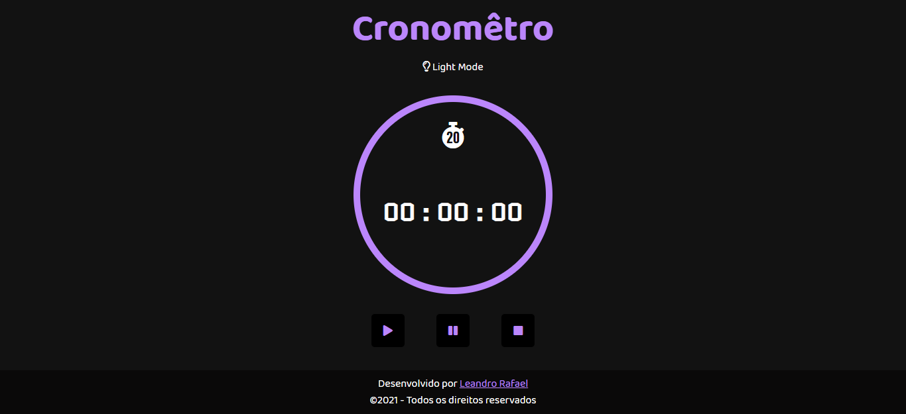
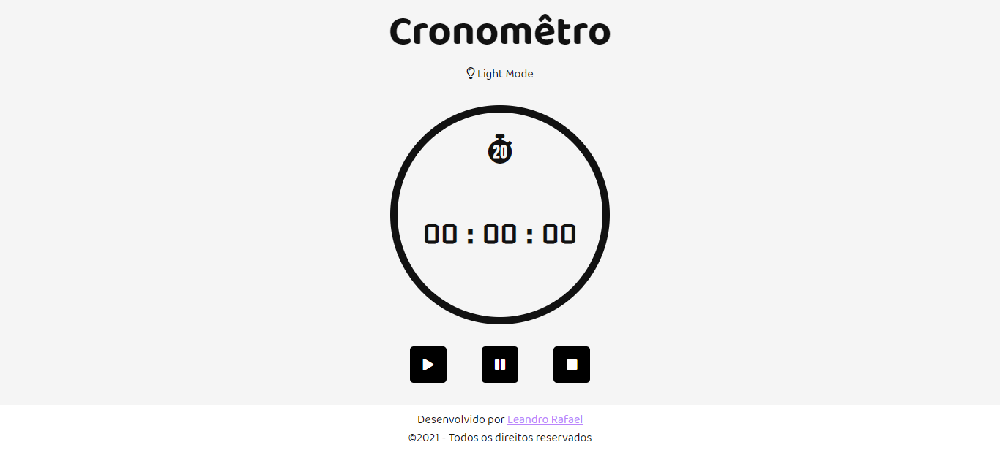

<div align ="center">

# Cronômetro Javascript

</div>

Esse projeto tem o objetivo de colocar em prática meus conhecimentos em Javascript, nele eu utilizo somente Javascript puro para fazer um cronômetro que tem controles para play, pause, reset e um botão onde você escolhe o tema claro ou o tema escuro.

* Demo: [Clique aqui para ver esse projeto](https://leandrorafaeel.github.io/cronometro-js/)

## Dark Mode:
<div align="left">
    
</div>

## Light Theme:
<div align="left">
    
</div>

## Tecnologias:
Esse projeto foi desenvolvido com as seguintes tecnologias:
* HTML5
* CSS3
* JAVASCRIPT

## Como usar:
Clone o repositório abaixo

```
git clone https://github.com/leandrorafaeel/cronometro-js/
```
## Autor: 
 

#### Leandro Rafael

[](https://www.linkedin.com/in/leandrorafael-dev/) [](https://twitter.com/leandrorafaelBR) 

## Licença:
[](https://opensource.org/licenses/MIT)

Este projeto está sob licença do MIT. Veja a licença para mais informações:

[Veja o Copyright](https://github.com/leandrorafaeel/cronometro-js/blob/master/LICENSE)